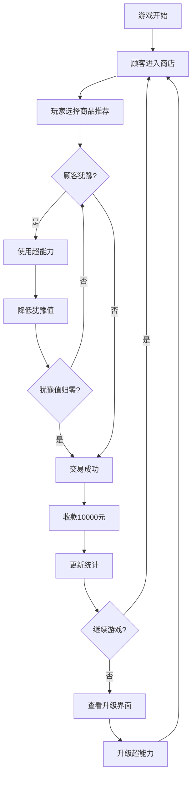

# 大守护村商店 - 产品需求文档

## 1. 产品概述
一款村庄商店经营模拟游戏，玩家扮演拥有超能力的店主，向村里的大守护们销售高价商品（每件一万元）。

玩家需要运用特殊能力来说服犹豫的顾客完成交易，体验独特的销售策略与经营乐趣。

## 2. 核心功能

### 2.1 用户角色
| 角色 | 说明 | 核心能力 |
|------|------|----------|
| 店主（玩家） | 游戏主角，拥有超能力 | 可使用特殊能力影响顾客决策 |
| 大守护（顾客） | 村里的居民，有钱但犹豫 | 拥有购买能力，需要被说服 |

### 2.2 功能模块
游戏包含以下主要页面：
1. **游戏主界面**：商店场景、商品展示、顾客互动、能力使用。
2. **能力升级界面**：查看和升级超能力、查看已解锁技能。

### 2.3 页面详情

| 页面名称 | 模块名称 | 功能描述 |
|----------|----------|----------|
| 游戏主界面 | 商店场景 | 展示温馨的村庄小店场景，包含货架、柜台等装饰元素 |
| 游戏主界面 | 商品展示 | 展示8种商品（手机、电脑、平板、台灯、桌子、椅子、书包、背包），每个商品售价10000元 |
| 游戏主界面 | 顾客系统 | 大守护顾客随机进入商店，显示顾客形象、犹豫值、购买力状态 |
| 游戏主界面 | 销售互动 | 点击商品推荐给顾客，顾客会表现出犹豫或兴趣 |
| 游戏主界面 | 超能力系统 | 使用超能力降低顾客犹豫值：心灵感应（查看顾客想法）、说服光环（降低犹豫）、时间暂停（思考策略） |
| 游戏主界面 | 交易结算 | 成功销售后显示收款动画，累计金币增加10000元 |
| 游戏主界面 | 数据统计 | 显示今日销售额、成功交易数、顾客满意度 |
| 能力升级界面 | 能力树 | 展示可升级的超能力分支：感知系、说服系、时间系 |
| 能力升级界面 | 升级操作 | 消耗金币提升能力等级，解锁新技能效果 |
| 能力升级界面 | 能力详情 | 显示各能力的当前等级、效果说明、升级所需金币 |

## 3. 核心流程

### 游戏主流程
玩家进入游戏后，会不断有大守护顾客进入商店。每位顾客都有较高的犹豫值，玩家需要选择合适的商品推荐给他们，并在适当时机使用超能力来降低顾客的犹豫，最终促成交易。每成功销售一件商品可获得10000元金币，金币可用于升级超能力，让后续销售更加轻松。

### 顾客决策流程
顾客进入商店 → 玩家推荐商品 → 顾客显示犹豫值 → 玩家选择是否使用超能力 → 超能力降低犹豫值 → 犹豫值归零则交易成功 → 收款并更新统计。

## 4. 用户界面设计

### 4.1 设计风格
- **主色调**：暖黄色（#F5E6C8）作为店铺主背景，营造温馨村庄氛围
- **辅助色**：深棕色（#8B4513）用于木质货架和家具，金色（#FFD700）用于金币和成功提示
- **按钮风格**：圆角矩形按钮，带轻微阴影，悬停时有放大效果
- **字体**：中文字体使用圆润可爱的风格，标题较大（24px），正文适中（16px）
- **布局**：左侧为商店场景，右侧为顾客信息和操作面板
- **图标风格**：卡通风格，商品和顾客形象可爱Q版

### 4.2 页面设计概述

| 页面名称 | 模块名称 | UI元素 |
|----------|----------|--------|
| 游戏主界面 | 商店场景 | 木质货架排列8种商品，每件商品有图标和价格标签（¥10000），背景为温馨村庄小屋风格 |
| 游戏主界面 | 顾客区域 | 右侧显示当前顾客Q版形象，头顶显示犹豫值进度条（红色），下方显示顾客内心想法气泡 |
| 游戏主界面 | 操作面板 | 底部显示超能力按钮（心灵感应、说服光环、时间暂停），有冷却时间指示器 |
| 游戏主界面 | 统计栏 | 顶部显示当前金币数（大号金色字体）、今日销售件数、顾客满意度星级 |
| 能力升级界面 | 能力树 | 中央展示三个能力分支树状图，已解锁节点高亮显示，未解锁节点灰色 |
| 能力升级界面 | 升级详情 | 点击能力节点显示详细效果说明和升级按钮，消耗金币数量醒目显示 |
| 能力升级界面 | 返回按钮 | 右下角返回游戏主界面按钮 |

### 4.3 响应式设计
- 桌面优先设计，主界面分辨率为1280x720
- 适配常见浏览器窗口大小，保持核心元素可见
- 移动端通过缩放适配，主要面向桌面端游戏体验

### 4.4 动画效果
- 顾客进入/离开：从右侧滑入滑出动画
- 犹豫值变化：进度条平滑过渡，数字跳动效果
- 交易成功：金币飞入钱包的粒子动画
- 超能力使用：屏幕边缘发光特效，对应能力专属动画
