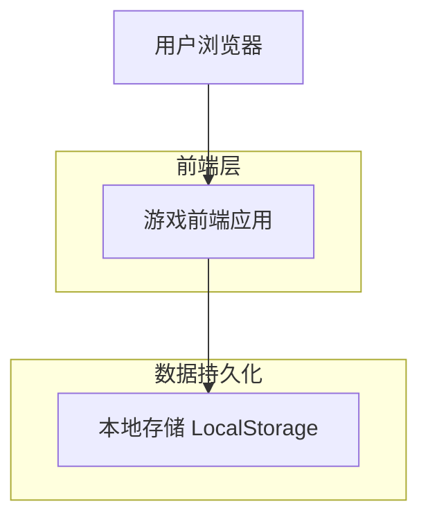
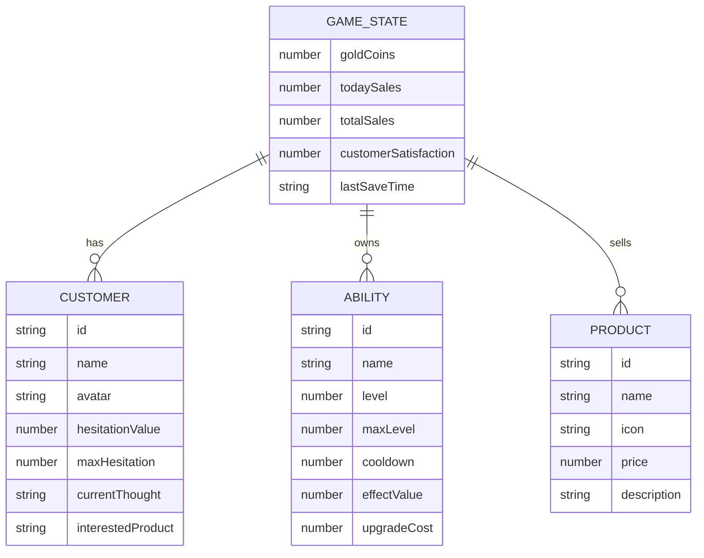

# 大守护村商店 - 技术架构文档

## 1. 架构设计



## 2. 技术描述

- **前端**: HTML5 + CSS3 + 原生 JavaScript（ES6+）
- **初始化工具**: 无需构建工具，纯静态文件
- **后端**: 无
- **数据存储**: LocalStorage（保存金币数量、能力等级、游戏进度）

## 3. 路由定义

| 路由/页面 | 用途 |
|-----------|------|
| index.html | 游戏主界面，包含商店场景、顾客互动、销售流程 |
| upgrade.html | 能力升级界面，展示和升级超能力 |

## 4. 核心数据模型

### 4.1 数据模型定义



### 4.2 数据定义

**商品数据 (Products)**
```javascript
const products = [
  { id: 'phone', name: '手机', icon: '📱', price: 10000, description: '最新款智能手机' },
  { id: 'computer', name: '电脑', icon: '💻', price: 10000, description: '高性能笔记本电脑' },
  { id: 'tablet', name: '平板', icon: '📲', price: 10000, description: '轻薄便携平板' },
  { id: 'lamp', name: '台灯', icon: '💡', price: 10000, description: '护眼LED台灯' },
  { id: 'table', name: '桌子', icon: '🪑', price: 10000, description: '实木办公桌' },
  { id: 'chair', name: '椅子', icon: '🪑', price: 10000, description: '人体工学椅' },
  { id: 'schoolbag', name: '书包', icon: '🎒', price: 10000, description: '大容量书包' },
  { id: 'backpack', name: '背包', icon: '🎒', price: 10000, description: '户外旅行背包' }
];
```

**超能力数据 (Abilities)**
```javascript
const abilities = [
  { 
    id: 'mindRead', 
    name: '心灵感应', 
    level: 1, 
    maxLevel: 5, 
    cooldown: 5, 
    effectValue: 10, 
    upgradeCost: 50000,
    description: '查看顾客内心想法，降低犹豫值'
  },
  { 
    id: 'persuade', 
    name: '说服光环', 
    level: 1, 
    maxLevel: 5, 
    cooldown: 8, 
    effectValue: 20, 
    upgradeCost: 50000,
    description: '释放光环大幅降低顾客犹豫'
  },
  { 
    id: 'timeStop', 
    name: '时间暂停', 
    level: 1, 
    maxLevel: 3, 
    cooldown: 15, 
    effectValue: 30, 
    upgradeCost: 100000,
    description: '暂停时间，思考最佳策略'
  }
];
```

**顾客数据 (Customers)**
```javascript
const customerTemplates = [
  { name: '守护大叔', avatar: '👨', baseHesitation: 80, thoughts: ['这个有点贵啊...', '我再想想...'] },
  { name: '守护阿姨', avatar: '👩', baseHesitation: 70, thoughts: ['能便宜点吗？', '一万元呢...'] },
  { name: '年轻守护', avatar: '🧑', baseHesitation: 60, thoughts: ['好像不错...', '值不值呢？'] },
  { name: '老守护', avatar: '👴', baseHesitation: 90, thoughts: ['太贵了太贵了', '以前没这么贵啊'] },
  { name: '守护小孩', avatar: '🧒', baseHesitation: 50, thoughts: ['我想要这个！', '妈妈会同意吗？'] }
];
```

### 4.3 LocalStorage 存储结构

```javascript
// 游戏存档键名: villageShop_save
const saveData = {
  goldCoins: 0,           // 当前金币
  todaySales: 0,          // 今日销售数
  totalSales: 0,          // 总销售数
  abilities: {            // 能力等级
    mindRead: 1,
    persuade: 1,
    timeStop: 1
  },
  unlockedProducts: ['phone', 'computer', 'tablet', 'lamp', 'table', 'chair', 'schoolbag', 'backpack'],
  lastPlayDate: '2026-04-11',
  customerSatisfaction: 5.0  // 顾客满意度（1-5星）
};
```

## 5. 核心游戏逻辑

### 5.1 顾客生成算法
```javascript
function generateCustomer() {
  const template = randomSelect(customerTemplates);
  return {
    id: generateId(),
    name: template.name,
    avatar: template.avatar,
    hesitationValue: template.baseHesitation + random(-10, 10),
    maxHesitation: template.baseHesitation,
    currentThought: randomSelect(template.thoughts),
    interestedProduct: randomSelect(products).id
  };
}
```

### 5.2 犹豫值计算
```javascript
function calculateHesitation(customer, abilityUsed) {
  let reduction = 0;
  switch(abilityUsed) {
    case 'mindRead': reduction = abilities.mindRead.effectValue * abilities.mindRead.level; break;
    case 'persuade': reduction = abilities.persuade.effectValue * abilities.persuade.level; break;
    case 'timeStop': reduction = abilities.timeStop.effectValue * abilities.timeStop.level; break;
  }
  customer.hesitationValue = Math.max(0, customer.hesitationValue - reduction);
  return customer.hesitationValue === 0; // 返回是否完成交易
}
```

### 5.3 交易结算
```javascript
function completeTransaction(product) {
  goldCoins += product.price;  // +10000
  todaySales++;
  totalSales++;
  customerSatisfaction = calculateSatisfaction();
  saveGame();
  showSuccessAnimation(product.price);
}
```

## 6. 文件结构

```
games/village-shop/
├── index.html          # 游戏主界面
├── upgrade.html        # 能力升级界面
├── css/
│   └── style.css       # 游戏样式
├── js/
│   ├── game.js         # 核心游戏逻辑
│   ├── customer.js     # 顾客系统
│   ├── ability.js      # 超能力系统
│   └── storage.js      # 本地存储管理
└── assets/
    └── (如需图片资源)
```
