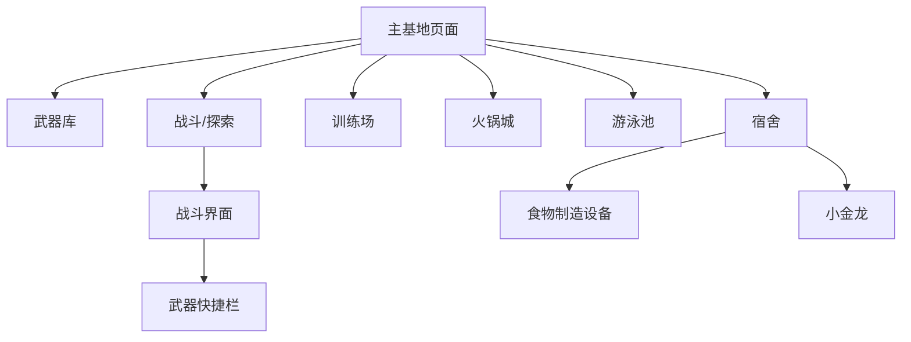

# 丧尸生存基地游戏 - 产品需求文档

## 1. 产品概述

一款以"听觉敏感、视觉失明、嗅觉敏锐"丧尸为敌人的生存策略游戏。玩家管理一个拥有大量幸存者的基地，与好友大刘、大王和指挥官一起生存，收集资源、制造武器、训练队员，抵御丧尸进攻。

目标用户：喜欢生存策略和基地建造类游戏的玩家。

## 2. 核心功能

### 2.1 角色系统

| 角色 | 类型 | 描述 |
|------|------|------|
| 玩家 | 主角 | 控制基地和队伍，拥有全部武器 |
| 大刘 | NPC好友 | 成年男性，战斗型角色 |
| 大王 | NPC好友 | 成年男性，防御型角色 |
| 指挥官 | NPC | 负责队伍指挥和战术安排 |
| 高级队员 | NPC | 战斗力较强的幸存者 |
| 低级队员 | NPC | 基础战斗力的幸存者 |
| 幸存者 | NPC群体 | 编号命名（1号、2号...），负责资源生产 |

### 2.2 功能模块

游戏包含以下核心页面：

1. **主基地页面**：基地全景视图，可进入各个功能建筑
2. **武器库页面**：购买、查看和管理武器装备
3. **宿舍页面**：幸存者休息区，包含食物制造设备
4. **训练场页面**：队员训练和提升能力
5. **火锅城页面**：用餐和士气恢复区域
6. **游泳池页面**：休闲和恢复区域
7. **战斗/探索页面**：外出战斗、收集资源

### 2.3 页面详情

| 页面名称 | 模块名称 | 功能描述 |
|----------|----------|----------|
| 主基地页面 | 基地全景 | 显示基地整体布局，点击建筑进入对应功能页面 |
| 主基地页面 | 冰火矿车 | 显示矿车状态，包含喇叭按钮（驱赶阻挡者）、心形按钮（自动造路） |
| 主基地页面 | 建筑导航 | 点击进入武器库、宿舍、训练场、火锅城、游泳池 |
| 武器库页面 | 武器展示 | 展示已拥有的武器，悬浮滑板、三栖摩托车、冰火剑、神龙魔方、多功能钻头 |
| 武器库页面 | 武器详情 | 点击武器查看属性和使用说明 |
| 武器库页面 | 武器购买 | 使用资源购买新武器 |
| 宿舍页面 | 食物制造设备 | 食物模仿机、快乐可乐制造机、纯净水制造机、神龙大礼包制造机 |
| 宿舍页面 | 幸存者列表 | 显示当前在宿舍休息的幸存者编号列表 |
| 宿舍页面 | 小金龙 | 显示可爱的小金龙宠物，可喂食神龙大礼包 |
| 训练场页面 | 队员训练 | 选择队员进行战斗训练，提升战斗能力 |
| 训练场页面 | 训练项目 | 力量训练、敏捷训练、战术训练等不同项目 |
| 火锅城页面 | 用餐系统 | 幸存者聚餐，恢复士气和体力 |
| 游泳池页面 | 休闲系统 | 幸存者游泳放松，恢复精神状态 |
| 战斗页面 | 武器快捷栏 | 右下角显示武器图标，点击切换武器 |
| 战斗页面 | 冰火剑系统 | B键融合冰火箭，V键解除融合，Q键释放大招 |
| 战斗页面 | 神龙魔方 | 点击后语音输入想要变形的物品，魔方变形 |
| 战斗页面 | 多功能钻头 | 点击选择钻头模式或盾牌模式 |
| 战斗页面 | 丧尸AI | 丧尸能听见声音、闻见气味，但看不见 |

## 3. 核心流程

### 3.1 日常运营流程

玩家进入主基地页面，可以：
1. 查看基地整体状态和资源储备
2. 点击冰火矿车进行资源运输或造路
3. 进入武器库购买或查看武器
4. 进入宿舍使用食物制造设备
5. 进入训练场训练队员
6. 进入火锅城或游泳池恢复幸存者状态

### 3.2 战斗流程

1. 从主基地出发进入战斗/探索
2. 右下角武器栏选择武器
3. 使用冰火剑时：B融合冰火箭，V解除，Q放大招
4. 使用神龙魔方：点击后语音输入变形目标
5. 使用多功能钻头：点击选择钻头或盾牌模式
6. 利用丧尸特性（听声、闻味）制定战术

### 3.3 页面导航流程图

## 4. 用户界面设计

### 4.1 设计风格

- **主色调**：暗绿色（#2d5016）代表生存，暗红色（#8b0000）代表危险
- **辅助色**：灰色（#4a4a4a）代表工业基地风格
- **按钮样式**：圆角矩形，带金属质感边框
- **字体**：无衬线字体，标题加粗，正文常规
- **布局**：卡片式布局，信息分区明确
- **图标风格**：扁平化+微阴影，末日生存主题

### 4.2 页面设计概览

| 页面名称 | 模块名称 | UI元素 |
|----------|----------|--------|
| 主基地页面 | 基地全景 | 俯视视角基地地图，建筑以图标表示，带悬浮提示 |
| 主基地页面 | 冰火矿车 | 矿车图标在基地内移动，显示名称标签，喇叭和心形按钮在矿车旁 |
| 武器库页面 | 武器展示 | 网格布局展示武器卡片，每张卡片显示武器图标、名称、属性 |
| 宿舍页面 | 食物设备 | 左侧显示设备列表，右侧显示制造界面和产出 |
| 宿舍页面 | 小金龙 | 右下角显示可爱小金龙动画，可点击互动 |
| 训练场页面 | 训练区域 | 中间显示训练场地，左侧队员列表，右侧训练项目 |
| 战斗页面 | 武器快捷栏 | 右下角固定位置，5个武器槽位，当前武器高亮 |
| 战斗页面 | 冰火剑UI | 屏幕上方显示当前状态（冰箭/火箭/融合），Q技能冷却条 |
| 战斗页面 | 神龙魔方 | 点击后弹出语音输入框，显示变形进度 |
| 战斗页面 | 多功能钻头 | 点击后弹出模式选择菜单（钻头/盾牌） |

### 4.3 响应式设计

- **桌面优先**：主要面向PC端玩家
- **分辨率适配**：支持1920x1080及以上分辨率
- **操作方式**：键盘+鼠标操作

### 4.4 丧尸AI设计

- **听觉系统**：丧尸对声音敏感，玩家移动、开枪会吸引丧尸
- **嗅觉系统**：丧尸能闻到玩家气味，距离近时会追踪
- **视觉缺失**：丧尸完全看不见，玩家可以静止躲避
- **行为表现**：丧尸移动时带有听觉波纹特效，闻到气味时显示嗅觉粒子效果
