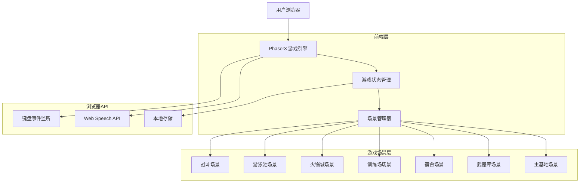
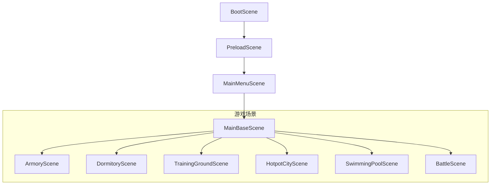

# 丧尸生存基地游戏 - 技术架构文档

## 1. 架构设计



## 2. 技术描述

- **游戏引擎**: Phaser3@3.70
- **前端框架**: 原生 JavaScript (ES6+)
- **构建工具**: Vite
- **初始化工具**: vite-init
- **图形渲染**: WebGL (通过Phaser3)
- **音频**: Web Audio API
- **语音输入**: Web Speech API
- **数据存储**: LocalStorage
- **后端**: None (纯前端游戏)

## 3. 路由定义

| 路由 | 用途 |
|------|------|
| /games/zombie-survival/index.html | 游戏主入口 |

**游戏内场景切换（非URL路由）**：

| 场景名称 | 用途 |
|----------|------|
| MainBaseScene | 主基地场景，基地全景和建筑入口 |
| ArmoryScene | 武器库场景，武器购买和管理 |
| DormitoryScene | 宿舍场景，食物制造和幸存者休息 |
| TrainingGroundScene | 训练场场景，队员训练 |
| HotpotCityScene | 火锅城场景，用餐恢复 |
| SwimmingPoolScene | 游泳池场景，休闲恢复 |
| BattleScene | 战斗场景，外出战斗和探索 |

## 4. 核心类定义

### 4.1 游戏实体类

```typescript
// 角色基类
class Character {
  id: string;
  name: string;
  type: 'player' | 'friend' | 'commander' | 'survivor';
  level: number;
  hp: number;
  maxHp: number;
  attack: number;
  defense: number;
  
  constructor(config: CharacterConfig);
  takeDamage(amount: number): void;
  heal(amount: number): void;
}

// 幸存者类
class Survivor extends Character {
  survivorNumber: number; // 1号、2号...
  job: 'worker' | 'fighter' | 'resting';
  morale: number;
  
  work(): void;
  rest(): void;
}

// NPC好友类
class FriendNPC extends Character {
  role: 'liu' | 'wang' | 'commander';
  specialty: 'combat' | 'defense' | 'tactics';
  
  assist(): void;
}
```

### 4.2 武器系统类

```typescript
// 武器基类
class Weapon {
  id: string;
  name: string;
  type: WeaponType;
  icon: string;
  description: string;
  
  equip(): void;
  unequip(): void;
}

// 冰火剑
class IceFireSword extends Weapon {
  state: 'ice' | 'fire' | 'fused';
  iceArrow: IceArrow;
  fireArrow: FireArrow;
  
  fuse(): void;      // B键融合
  unfuse(): void;    // V键解除
  ultimate(): void;  // Q键大招
}

// 神龙魔方
class DragonCube extends Weapon {
  currentForm: string;
  
  transform(targetForm: string): void; // 语音输入变形
}

// 多功能钻头
class MultiDrill extends Weapon {
  mode: 'drill' | 'shield';
  
  switchMode(mode: 'drill' | 'shield'): void;
}

// 悬浮滑板
class HoverBoard extends Weapon {
  isFlying: boolean;
  
  toggleFlight(): void;
}

// 三栖摩托车
class AmphibiousMotorcycle extends Weapon {
  terrain: 'land' | 'water' | 'air';
  
  switchTerrain(terrain: TerrainType): void;
}
```

### 4.3 丧尸AI类

```typescript
// 丧尸类
class Zombie {
  id: string;
  x: number;
  y: number;
  hearingRange: number;
  smellRange: number;
  state: 'idle' | 'hearing' | 'smelling' | 'chasing';
  
  // 感知系统
  hear(soundSource: SoundEvent): void;
  smell(playerPosition: Position): void;
  
  // 行为系统
  chase(target: Position): void;
  wander(): void;
  
  // 更新
  update(delta: number): void;
}

// 声音事件
interface SoundEvent {
  x: number;
  y: number;
  volume: number; // 音量决定传播距离
  source: string;
}
```

### 4.4 基地设施类

```typescript
// 食物制造设备
class FoodMachine {
  type: 'food_mimic' | 'happy_cola' | 'pure_water' | 'dragon_gift';
  isProducing: boolean;
  progress: number;
  
  startProduction(): void;
  collect(): Item;
}

// 冰火矿车
class IceFireMinecart {
  name: string;
  position: Position;
  
  honk(): void;      // 喇叭
  buildRoad(): void; // 自动造路
}

// 小金龙
class LittleDragon {
  mood: number;
  hunger: number;
  
  feed(gift: DragonGift): void;
  play(): void;
}
```

## 5. 数据模型

### 5.1 本地存储数据结构

```typescript
// 游戏存档
interface GameSave {
  version: string;
  lastSaveTime: number;
  
  // 玩家数据
  player: {
    name: string;
    level: number;
    exp: number;
    resources: Resources;
    equippedWeapons: string[];
  };
  
  // 基地数据
  base: {
    buildings: BuildingData[];
    machines: MachineData[];
    minecart: MinecartData;
  };
  
  // 角色数据
  characters: {
    friends: FriendData[];
    survivors: SurvivorData[];
    survivorCount: number;
  };
  
  // 武器数据
  weapons: {
    owned: string[];
    iceFireSword: IceFireSwordData;
    dragonCube: DragonCubeData;
    multiDrill: MultiDrillData;
  };
  
  // 小金龙数据
  littleDragon: LittleDragonData;
}

// 资源
interface Resources {
  food: number;
  water: number;
  materials: number;
  energy: number;
}
```

### 5.2 配置文件

```javascript
// 武器配置
const WEAPON_CONFIG = {
  iceFireSword: {
    name: '冰火剑',
    damage: 50,
    iceArrow: { name: '冰箭', damage: 30, effect: 'slow' },
    fireArrow: { name: '火箭', damage: 40, effect: 'burn' },
    fusedDamage: 100,
    ultimateDamage: 200
  },
  dragonCube: {
    name: '神龙魔方',
    description: '可以变成任何东西',
    forms: ['weapon', 'tool', 'vehicle', 'shield']
  },
  multiDrill: {
    name: '多功能钻头',
    modes: {
      drill: { damage: 60, speed: 1.5 },
      shield: { defense: 80, blockChance: 0.5 }
    }
  },
  hoverBoard: {
    name: '悬浮滑板',
    speed: 2.0,
    canFly: true
  },
  amphibiousMotorcycle: {
    name: '三栖摩托车',
    speed: 2.5,
    terrains: ['land', 'water', 'air']
  }
};

// 丧尸配置
const ZOMBIE_CONFIG = {
  hearingRange: 200,
  smellRange: 150,
  moveSpeed: 80,
  chaseSpeed: 120,
  hp: 100,
  damage: 20
};

// 建筑配置
const BUILDING_CONFIG = {
  armory: { name: '武器库', unlockLevel: 1 },
  dormitory: { name: '宿舍', unlockLevel: 1 },
  training: { name: '训练场', unlockLevel: 2 },
  hotpot: { name: '火锅城', unlockLevel: 3 },
  pool: { name: '游泳池', unlockLevel: 3 }
};
```

## 6. 场景架构



## 7. 输入控制系统

| 按键 | 功能 |
|------|------|
| B | 冰火剑融合冰火箭 |
| V | 冰火剑解除融合 |
| Q | 冰火剑释放大招 |
| 1-5 | 切换武器快捷栏 |
| WASD/方向键 | 移动 |
| 鼠标左键 | 攻击/选择/点击 |
| 鼠标右键 | 特殊功能/菜单 |
| ESC | 打开菜单/返回 |

## 8. 语音输入集成

```javascript
// Web Speech API 集成
class VoiceInputManager {
  constructor() {
    this.recognition = new (window.SpeechRecognition || window.webkitSpeechRecognition)();
    this.recognition.lang = 'zh-CN';
    this.recognition.continuous = false;
    this.recognition.interimResults = false;
  }
  
  startListening(callback: (transcript: string) => void): void {
    this.recognition.onresult = (event) => {
      const transcript = event.results[0][0].transcript;
      callback(transcript);
    };
    this.recognition.start();
  }
  
  stopListening(): void {
    this.recognition.stop();
  }
}
```
